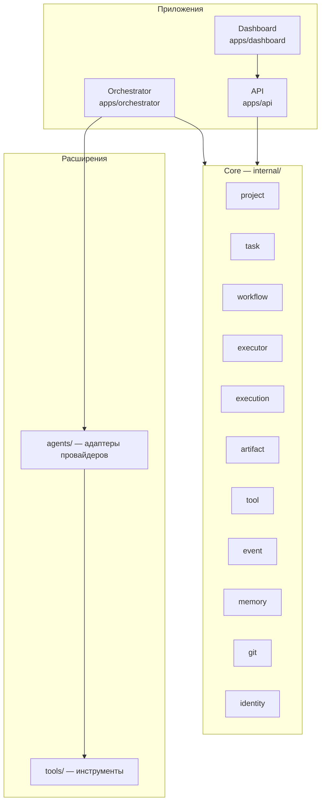

# Компоненты системы

## Назначение

Перечень компонентов AI Studio OS с зонами ответственности и границами. Служит справочником при проектировании модулей и распределении новой функциональности. Границы зависимостей — [module-boundaries.md](module-boundaries.md); доменные модули ядра — [core.md](core.md).

## Содержание

### Component Diagram

### Принципы выделения компонентов

- Один компонент — одна зона ответственности (Single Responsibility, Small Modules).
- Компоненты взаимодействуют через события и явные контракты (Interface First); правила — [module-boundaries.md](module-boundaries.md).
- Новая функциональность добавляется расширением, а не изменением ядра.

### Компоненты

#### API (`apps/api/`)

Внешний интерфейс платформы: доступ клиентов к данным о проектах, задачах, агентах и событиях. Не содержит доменной логики. Протокол — [ADR-003](../adr/ADR-003-api-protocol.md); аутентификация — [ADR-012](../adr/ADR-012-identity-and-auth.md).

#### Dashboard (`apps/dashboard/`)

Веб-интерфейс для людей: наблюдение за процессом, управление проектами и задачами. Работает только через API.

#### Orchestrator (`apps/orchestrator/`)

Координатор процесса: назначение исполнителей ролей, запуск исполнителей (через контракт Executor), реакция на события жизненного цикла задач. Доменных правил и durable-состояния не содержит ([core.md](core.md)).

#### Ядро (`internal/`)

Структура по слоям ([ADR-015](../adr/ADR-015-internal-layering.md)): `internal/domain/` — предметная область (`shared` — язык домена; модули, концептуальный набор — одиннадцать: `project`, `task`, `workflow`, `executor`, `execution`, `artifact`, `tool`, `event`, `memory`, `git`, `identity`; `artifact` — самостоятельный Aggregate Root, не часть `execution`, [ADR-016](../adr/ADR-016-artifact-aggregate-root.md)), `internal/application`, `internal/platform` (абстракции платформы: EventBus, Executor, Tool, MemoryProvider, RepositoryProvider), `internal/infrastructure`. Ответственность и владение сущностями — [core.md](core.md) и [domain-model.md](domain-model.md); границы — [module-boundaries.md](module-boundaries.md).

#### Публичные пакеты (`pkg/`)

Вспомогательный переиспользуемый код без доменной логики (утилиты, общие типы). Может использоваться внешними проектами.

#### Агенты (`agents/`)

Адаптеры технических бэкендов к контракту Executor ([interfaces.md](interfaces.md)); Claude Code — по умолчанию для роли Developer. Контракт — принято, [ADR-005](../adr/ADR-005-executor-contract.md); среда выполнения — [ADR-006](../adr/ADR-006-agent-execution-environment.md).

#### Инструменты (`tools/`)

Реализации контракта Tool: действия агентов во внешней среде (git, файлы, тесты). Подключаются декларативно, без изменения ядра. Подробнее: [tools.md](tools.md).

#### Память (`memory/`)

Файловое хранилище знаний проектов; с v0.7 — семантический поиск через Qdrant. Подробнее: [memory.md](memory.md).

#### Система задач (`tasks/`)

Файловый жизненный цикл задач. Канонические состояния — [state-machine.md](state-machine.md); процесс — [workflow.md](workflow.md); источник истины — [ADR-004](../adr/ADR-004-task-storage.md).

#### Управляемые проекты (`projects/`)

Каталог проектов, разработкой которых управляет платформа. Формат — Decision Required ([ADR-013](../adr/ADR-013-managed-projects.md)).

### Decision Required

- [ADR-013](../adr/ADR-013-managed-projects.md) — формат `projects/`.
- [ADR-014](../adr/ADR-014-module-interaction.md) — взаимодействие модулей ядра.
- [ADR-009](../adr/ADR-009-toolchain.md) — физическое размещение адаптеров инфраструктуры.

## Статус

Актуален

## Последнее обновление

2026-07-20
