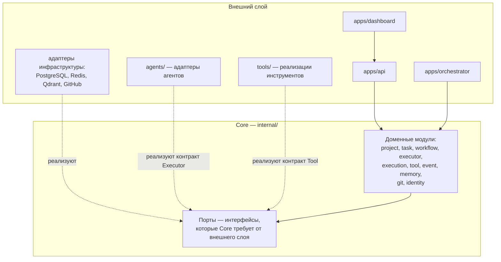

# Ядро системы

## Назначение

Определяет состав ядра (Core) AI Studio OS: какие модули в него входят, что остаётся за его пределами, кто управляет состоянием и какие зависимости допустимы. Детализация границ каждого модуля — в [module-boundaries.md](module-boundaries.md).

## Содержание

### Что такое Core

Core — доменная логика платформы, размещаемая в `internal/`. Это единственное место, где живут бизнес-правила: жизненные циклы сущностей, инварианты, доменные события. Core не знает об инфраструктуре (PostgreSQL, Redis, GitHub, AI-провайдеры) и о способах доставки (HTTP, UI).

Направление зависимостей: внешний слой зависит от Core; Core не зависит ни от чего, кроме `pkg/` и стандартной библиотеки.

### Что входит в Core

| Модуль | Ответственность |
| --- | --- |
| `project` | Проекты, подключение репозиториев, назначения исполнителей ролей |
| `task` | Эпики и задачи, их состояние по канонической state machine |
| `workflow` | Определения процессов, шаги, роли, правила переходов |
| `executor` | Реестр исполнителей (Executor), их возможности и статус |
| `execution` | Исполнения, результаты, артефакты |
| `tool` | Реестр инструментов, сопоставление ролям |
| `event` | Шина событий (контракт) и журнал событий |
| `memory` | Знания проектов, контракт поиска |
| `git` | Доменное представление Repository, Branch, PullRequest, Review |
| `identity` | Пользователи и сессии (объём в MVP — [ADR-012](../adr/ADR-012-identity-and-auth.md)) |

Владение сущностями — в [domain-model.md](domain-model.md). Каждый модуль также объявляет **порты** — интерфейсы, которые ему нужны от инфраструктуры (хранение, доставка событий, git-хостинг и т.д.).

### Что НЕ входит в Core

- **Приложения** (`apps/api`, `apps/dashboard`, `apps/orchestrator`) — доставка и координация, без бизнес-правил.
- **Адаптеры инфраструктуры** — реализации портов для PostgreSQL, Redis, Qdrant, GitHub.
- **Адаптеры агентов** (`agents/`) — привязка технических бэкендов к контракту Executor.
- **Реализации инструментов** (`tools/`) — действия во внешней среде.
- **Переиспользуемые утилиты** (`pkg/`) — вспомогательный код без доменного знания.
- **Схемы БД, миграции, конфигурация** — принадлежность инфраструктуре.

### Управление состоянием

1. **Каждый модуль — единственный владелец своего состояния.** Изменить состояние сущности может только модуль-владелец через свои операции.
2. **Изменение снаружи — только командой модулю-владельцу**; результат изменения объявляется событием.
3. **Чтение чужих данных** — только через события: заинтересованный модуль строит собственную проекцию; синхронные read-контракты не вводятся (принято, [ADR-014](../adr/ADR-014-module-interaction.md)).
4. **Orchestrator доменного состояния не хранит** — он реагирует на события и подаёт команды модулям; всё durable-состояние находится в модулях Core.
5. **Проекции для чтения** (например, для Dashboard) не являются источником истины и могут быть перестроены из событий и состояния модулей.

### Допустимые зависимости Core

- Стандартная библиотека языка.
- `pkg/` (утилиты без доменного знания).
- Собственные порты (интерфейсы), объявленные модулем.
- Схемы событий других модулей (как публичные контракты).

### Запрещённые зависимости Core

- Любые инфраструктурные библиотеки и драйверы (БД, кэш, HTTP-клиенты, SDK провайдеров).
- Импорт внутренних пакетов других модулей (только публичные контракты).
- Зависимость от `apps/`, `agents/`, `tools/`.
- Фреймворки, диктующие структуру кода домена.

### Статус решений

- [ADR-014](../adr/ADR-014-module-interaction.md) — **принято**: все проходят через Core (Core → Events → Workflow → Executor Runtime → Tools; дословная формулировка ADR-014 — «Agent Runtime», терминология обновлена после [ADR-005](../adr/ADR-005-executor-contract.md), суть не менялась); междоменное чтение — только через события и собственные проекции; запрещены Tool → Core, Executor → Database, Workflow → SQL.
- [ADR-002](../adr/ADR-002-event-delivery.md) — **принято**: In-Memory Event Bus; интерфейс неизменен при смене реализации.
- [ADR-012](../adr/ADR-012-identity-and-auth.md) — **Decision Required**: входит ли `identity` в MVP.

Физическая структура ([ADR-015](../adr/ADR-015-internal-layering.md)): язык домена — `internal/domain/shared`; доменные модули — `internal/domain/<module>`; платформенные абстракции (EventBus, Executor, Tool, MemoryProvider, RepositoryProvider) — `internal/platform`; слои `internal/application` и `internal/infrastructure` заполняются последующими эпиками. Правила — [module-boundaries.md](module-boundaries.md).

## Статус

Актуален

## Последнее обновление

2026-07-20
