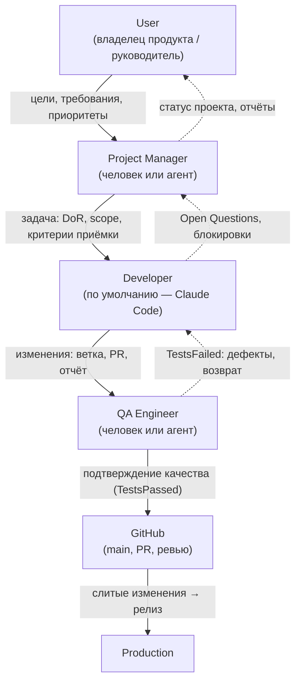

# Потоки данных

## Назначение

Описывает движение информации в AI Studio OS: от цели, поставленной человеком, до изменений в Production. Дополняет [system-design.md](system-design.md) (структура) и [events.md](events.md) (события): здесь — что и между кем передаётся.

## Содержание

### Data Flow Diagram

Сплошные стрелки — основной поток создания ценности; пунктирные — обратные связи.

### Описание потоков

#### User → Project Manager

Человек передаёт цели, требования и приоритеты (через Dashboard, с v0.6). Project Manager превращает их в эпики и задачи, доведённые до Definition of Ready. Обратно User получает статус проекта: состояние задач, отчёты, Open Questions, требующие его решения.

#### Project Manager → Developer

Developer получает задачу из `ready/`: цель, scope, критерии приёмки, контекст (документы, ADR, память проекта). Для агента назначение оформляется как Execution с контекстом по контракту Agent ([interfaces.md](interfaces.md)). Обратно PM получает блокировки и Open Questions.

#### Developer → QA

QA получает: Pull Request с изменениями, отчёт исполнителя, обновлённую документацию — после одобренного ревью кода (стадия Review пройдена, задача в Testing). Обратно Developer получает результат проверки: TestsFailed с дефектами и сценариями воспроизведения — возврат в работу.

#### QA → GitHub

Подтверждение качества (TestsPassed) снимает последнее процессное условие слияния/завершения. В GitHub фиксируются: одобренное ревью, результат проверок, слияние PR в `main` (точный порядок слияния относительно Testing — [ADR-008](../adr/ADR-008-git-policies.md)).

#### GitHub → Production

Слитые в `main` изменения образуют готовый к поставке результат. Механизм поставки (релизы, деплой) — предмет этапа эксплуатации (после v0.6, `docs/operations/`); на уровне архитектуры фиксируется только принцип: в Production попадает только то, что прошло полный цикл задачи.

### Хранилища на пути данных

| Данные | Где живут | Примечание |
| --- | --- | --- |
| Задачи и их история | `tasks/` (файлы) и/или PostgreSQL | Источник истины — [ADR-004](../adr/ADR-004-task-storage.md) |
| События | Журнал событий | Механизм — [ADR-002](../adr/ADR-002-event-delivery.md) |
| Код и изменения | GitHub (репозитории проектов) | Через Repository Provider |
| Артефакты исполнений | Модуль `execution` | Хранилище уточняется при реализации |
| Знания проекта | `memory/`, с v0.7 — Qdrant | [memory.md](memory.md) |
| Проекции для чтения | PostgreSQL/Redis | Перестраиваемы из событий |

### Наблюдаемость потока

Каждый переход данных между участниками сопровождается событием ([events.md](events.md)) и виден в Dashboard через проекции. Поток полностью восстановим по журналу событий и истории в файлах задач.

## Статус

Актуален

## Последнее обновление

2026-07-19
