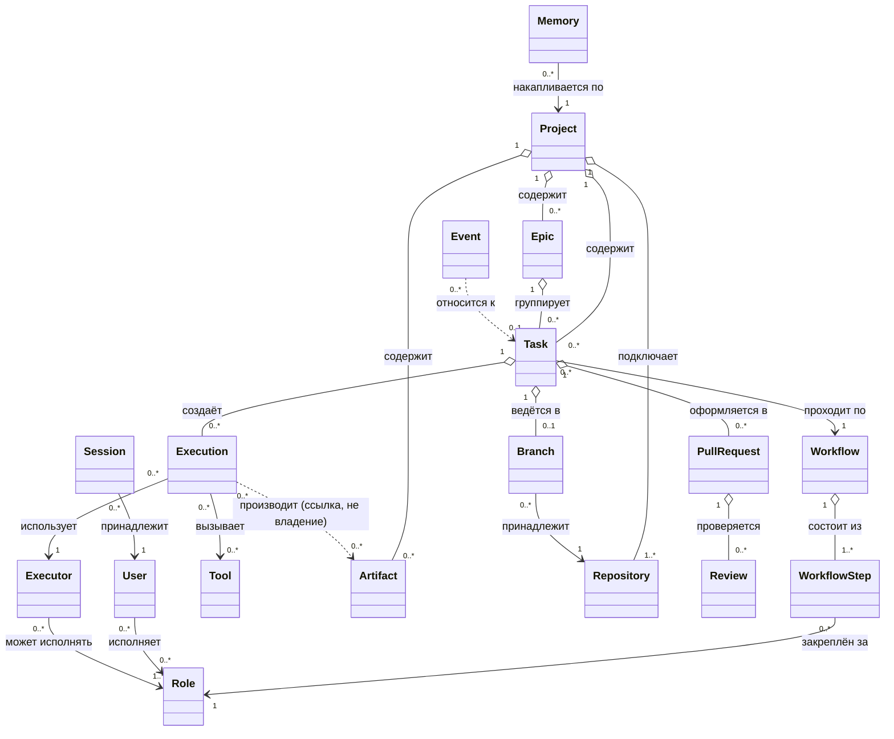

# Доменная модель

## Назначение

Описывает все основные сущности AI Studio OS: назначение, ответственность, жизненный цикл, связи, ограничения и владельца данных каждой сущности. Является источником истины для проектирования модулей и моделей данных. Без кода — только концептуальное описание.

## Содержание

### Domain Diagram

Диаграмма отражает порядок значимости, а не только связи: Artifact и Execution/Executor — то, что система производит и чем это производится, — а не второстепенные атрибуты Task (см. «Порядок проектирования Domain Layer» ниже). `Result` как отдельная сущность не вводится: Execution напрямую производит Artifact и несёт статус (`ExecutionStatus`) — согласовано с уже принятым контрактом [ADR-005](../adr/ADR-005-executor-contract.md) (`Accept`/`Artifacts`/`Status`/`Finish`, без обёртки Result). **Artifact — самостоятельный Aggregate Root** ([ADR-016](../adr/ADR-016-artifact-aggregate-root.md), решение архитектора 2026-07-20): Execution производит Artifact, но никогда им не владеет (пунктирная связь `..>`, не агрегация) — Artifact может существовать до задачи, во время исполнения или после его завершения, независимо от конкретного Execution.

### Сущности

#### Project (Проект)

- **Назначение:** проект разработки ПО, которым управляет платформа.
- **Ответственность:** объединяет эпики, задачи, репозитории, память и назначения исполнителей ролей; задаёт контекст всей работы.
- **Жизненный цикл:** Created → Active → Archived.
- **Связи:** содержит Epic и Task; подключает Repository; по проекту накапливается Memory; в проекте назначаются исполнители ролей (User/Agent → Role).
- **Ограничения:** проект имеет минимум один Repository; архивированный проект неизменяем.
- **Владелец данных:** модуль `project`.

#### Epic (Эпик)

- **Назначение:** крупная цель, декомпозируемая на задачи.
- **Ответственность:** группирует задачи вокруг цели; фиксирует scope и критерии завершения ([шаблон Epic](../../.claude/templates/Epic.md)).
- **Жизненный цикл:** Draft → Active → Completed | Cancelled → Archived.
- **Связи:** принадлежит Project; группирует Task.
- **Ограничения:** эпик завершается только когда завершены или отменены все его задачи.
- **Владелец данных:** модуль `task`.

#### Task (Задача)

- **Назначение:** единица работы с формализованным жизненным циклом.
- **Ответственность:** несёт цель, scope, критерии приёмки, историю переходов и отчёты ([шаблон Task](../../.claude/templates/Task.md)).
- **Жизненный цикл:** канонический, 9 состояний — [state-machine.md](state-machine.md).
- **Связи:** принадлежит Project (и опционально Epic); проходит по Workflow; порождает Execution; ведётся в Branch; оформляется в PullRequest; события (Event) фиксируют её историю.
- **Ограничения:** переходы состояний — только разрешённые state machine; в работе — только задачи, прошедшие Definition of Ready; формат идентификатора — Decision Required ([ADR-011](../adr/ADR-011-task-identifiers.md)).
- **Владелец данных:** модуль `task`. Источник истины (файлы `tasks/` или БД) — Decision Required ([ADR-004](../adr/ADR-004-task-storage.md)).

#### Workflow (Рабочий процесс)

- **Назначение:** определение процесса прохождения задачи: перечень шагов и правил переходов.
- **Ответственность:** задаёт, какие шаги в каком порядке проходит задача и какая роль отвечает за каждый шаг.
- **Жизненный цикл:** Draft → Published → Deprecated; опубликованная версия неизменяема, изменения — новой версией.
- **Связи:** состоит из WorkflowStep; по нему проходят Task.
- **Ограничения:** переходы не могут противоречить канонической state machine задачи; в MVP существует один стандартный workflow.
- **Владелец данных:** модуль `workflow`.

#### Workflow Step (Шаг процесса)

- **Назначение:** отдельный шаг workflow (например: планирование, реализация, ревью, тестирование).
- **Ответственность:** определяет ответственную роль, условия входа и выхода (критерии готовности шага).
- **Жизненный цикл:** не имеет собственного цикла — существует в составе версии Workflow.
- **Связи:** входит в Workflow; закреплён за Role; выполнение шага порождает Execution.
- **Ограничения:** шаг имеет ровно одну ответственную роль; условия выхода проверяемы.
- **Владелец данных:** модуль `workflow`.

#### Executor (Исполнитель)

- **Назначение:** реальный технический бэкенд, подключённый к платформе через адаптер и выполняющий назначенную работу в рамках роли (человек, Claude Code, OpenAI Codex, OpenHands, Aider, Cline и др.). Не путать с Agent — логической ролью-исполнителем («Developer Agent»), которая не вводится отдельной сущностью, а выражается связкой Role + Executor ([ubiquitous-language.md](../domain/ubiquitous-language.md), [ADR-005](../adr/ADR-005-executor-contract.md)).
- **Ответственность:** представляет конкретного провайдера с его возможностями и настройками; принимает задачу, производит Artifact, отчитывается о статусе, завершает исполнение.
- **Жизненный цикл:** Registered → Active ⇄ Disabled → Retired.
- **Связи:** может исполнять одну или несколько Role; выполняет Execution; использует Tool.
- **Ограничения:** Executor действует только через контракт адаптера — ровно четыре возможности, [ADR-005](../adr/ADR-005-executor-contract.md) (`Accept`/`Artifacts`/`Status`/`Finish`); набор доступных инструментов определяется ролью и задачей, а не исполнителем.
- **Владелец данных:** модуль `executor`.

#### Tool (Инструмент)

- **Назначение:** действие во внешней среде, доступное агентам через Tool Layer.
- **Ответственность:** декларирует имя, назначение, параметры, ограничения; выполняет ровно одно действие.
- **Жизненный цикл:** Registered → Available ⇄ Disabled → Retired.
- **Связи:** вызывается в рамках Execution; доступность определяется Role и Task.
- **Ограничения:** не содержит доменной логики платформы; каждый вызов журналируется событием.
- **Владелец данных:** модуль `tool`.

#### Event (Событие)

- **Назначение:** зафиксированный факт, произошедший в системе; единственный способ междоменного взаимодействия.
- **Ответственность:** переносит данные о факте подписчикам; образует журнал истории системы.
- **Жизненный цикл:** Published → Delivered → Archived. Событие неизменяемо с момента публикации.
- **Связи:** относится к доменной сущности (чаще всего Task); публикуется модулем-источником; потребляется подписчиками.
- **Ограничения:** именуется в прошедшем времени; схема события — часть публичного контракта модуля-источника; каталог событий — [events.md](events.md); механизм доставки — Decision Required ([ADR-002](../adr/ADR-002-event-delivery.md)).
- **Владелец данных:** модуль `event` (шина и журнал); схемы — модули-источники.

#### Memory (Память)

- **Назначение:** запись знаний, накапливаемых по проекту (решения, опыт, факты).
- **Ответственность:** хранит знание с метаданными для последующего поиска (с v0.7 — семантического, через Qdrant).
- **Жизненный цикл:** Recorded → Indexed → Superseded (устарела, заменена новой записью).
- **Связи:** принадлежит Project; создаётся по итогам Execution и решений людей.
- **Ограничения:** память — не источник истины (приоритет — документация и код); знания разных проектов не смешиваются ([memory.md](memory.md)).
- **Владелец данных:** модуль `memory`.

#### Artifact (Артефакт)

- **Назначение:** любое долговременное инженерное произведение, созданное или изменённое системой исполнения — коммит, Pull Request, исходный файл, Markdown, ADR, спецификация, test report, build report, диаграмма, скриншот, Figma-файл, release note (в перспективе: video, audio, dataset, prompt, knowledge entry). Первичная сущность результата работы платформы — не Result, не Output, не Response; **самостоятельный Aggregate Root**, не часть Execution/Task/Project ([ADR-016](../adr/ADR-016-artifact-aggregate-root.md), решение архитектора 2026-07-20): система производит именно артефакты, задачи — лишь способ организовать работу к их производству.
- **Ответственность:** сохраняет произведённый результат в неизменном виде с привязкой к источнику. Состоит из **Metadata** (ID, Type, Author, CreatedAt, ProducedByExecution, Version — то, что знает платформа) и **Payload** (сами данные, тип которых зависит от Type — Markdown, Git Commit, PDF, JSON, Binary; содержимое платформа не интерпретирует).
- **Жизненный цикл:** Created → Stored → Archived. Неизменяем после создания. Может существовать до задачи (например, импортированный документ), во время исполнения, после завершения задачи или независимо от конкретного исполнителя — поэтому не связан жизненным циклом ни с Execution, ни с Task, ни с Project.
- **Связи:** производится Execution (ссылка «я произвёл этот Artifact», не владение); принадлежит Project напрямую (`Project ├── Task └── Artifact`).
- **Ограничения:** артефакт всегда имеет тип и источник; удаление запрещено (только архивирование). НЕ является Artifact: временный лог, прогресс выполнения, heartbeat, токен LLM, внутреннее сообщение агента — это принадлежит Execution, не результат системы.
- **Владелец данных:** модуль `artifact`.

#### Execution (Исполнение)

- **Назначение:** один запуск Executor'а для выполнения задачи или шага workflow.
- **Ответственность:** фиксирует, кто, что, когда и с каким контекстом выполнял; отслеживает ход выполнения; производит Artifact и несёт статус (`ExecutionStatus`) напрямую — без промежуточной сущности Result ([ADR-005](../adr/ADR-005-executor-contract.md)). Execution **никогда не владеет** произведённым Artifact — хранит только ссылку на него ([ADR-016](../adr/ADR-016-artifact-aggregate-root.md)).
- **Жизненный цикл:** Queued → Running → Succeeded | Failed | Aborted.
- **Связи:** порождается Task (в рамках WorkflowStep); использует Executor; вызывает Tool; производит 0..* Artifact (по ссылке, не по владению).
- **Ограничения:** одно исполнение — один исполнитель и одна задача.
- **Владелец данных:** модуль `execution`.

#### Repository (Репозиторий)

- **Назначение:** git-репозиторий управляемого проекта на GitHub.
- **Ответственность:** представляет подключённый репозиторий и его настройки в платформе.
- **Жизненный цикл:** Connected → Active → Disconnected.
- **Связи:** принадлежит Project; содержит Branch; в нём открываются PullRequest.
- **Ограничения:** доступ к репозиторию — только через контракт Repository Provider ([interfaces.md](interfaces.md)); способ подключения принят ([ADR-013](../adr/ADR-013-managed-projects.md)) — на практике репозитории живут как `[]string` на агрегате `Project`, не как отдельная сущность с собственным жизненным циклом (упрощение, сложившееся при реализации EPIC-003/008, не отражённое здесь до 2026-07-23).
- **Владелец данных:** модуль `git`.

#### Branch (Ветка)

- **Назначение:** git-ветка, в которой ведётся работа над задачей.
- **Ответственность:** изолирует изменения задачи до слияния.
- **Жизненный цикл:** Created → Active → Merged | Deleted.
- **Связи:** принадлежит Repository; связана с Task (одна рабочая ветка на задачу).
- **Ограничения:** именование — по [git-workflow.md](../development/git-workflow.md); прямые изменения основной ветки запрещены.
- **Владелец данных:** модуль `git`.

#### Pull Request

- **Назначение:** предложение изменений из ветки задачи в основную ветку.
- **Ответственность:** носитель изменений и точка проверки: описание, чек-листы, связь с задачей.
- **Жизненный цикл:** Open → Merged | Closed.
- **Связи:** принадлежит Repository (из Branch); связан с Task; проверяется Review.
- **Ограничения:** один PR — одна задача; слияние — только после одобренного Review; политика слияния — Decision Required ([ADR-008](../adr/ADR-008-git-policies.md)).
- **Владелец данных:** модуль `git`.

#### Review (Ревью)

- **Назначение:** проверка Pull Request ролью Reviewer.
- **Ответственность:** фиксирует вердикт (Approved / Changes Requested) и замечания.
- **Жизненный цикл:** Requested → In Progress → Approved | Changes Requested.
- **Связи:** принадлежит PullRequest; выполняется исполнителем роли Reviewer; результат влияет на переход Task (Review → Testing или возврат).
- **Ограничения:** процесс — по [review-process.md](../development/review-process.md); число обязательных ревью — Decision Required ([ADR-008](../adr/ADR-008-git-policies.md)).
- **Владелец данных:** модуль `git`.

#### User (Пользователь)

- **Назначение:** человек, работающий с платформой.
- **Ответственность:** идентичность человека: имя, контакты, права.
- **Жизненный цикл:** Invited → Active ⇄ Suspended → Deactivated.
- **Связи:** исполняет Role в проектах; открывает Session.
- **Ограничения:** модель аутентификации и объём identity в MVP — Decision Required ([ADR-012](../adr/ADR-012-identity-and-auth.md)).
- **Владелец данных:** модуль `identity`.

#### Role (Роль)

- **Назначение:** набор обязанностей в процессе разработки (Project Manager, Developer, QA Engineer, Reviewer, Architect).
- **Ответственность:** определяет, что исполнитель обязан и не вправе делать; описания — [.claude/agents/](../../.claude/agents/).
- **Жизненный цикл:** Defined → Active; в MVP набор ролей фиксирован.
- **Связи:** исполняется User или Agent; за ролью закрепляются WorkflowStep; роль определяет доступные Tool.
- **Ограничения:** роль отделена от исполнителя; исполнители ролей PM и QA в MVP — Decision Required ([ADR-007](../adr/ADR-007-pm-qa-executors.md)).
- **Владелец данных:** модуль `workflow` (роль — часть определения процесса).

#### Session (Сессия)

- **Назначение:** аутентифицированный сеанс работы пользователя с платформой.
- **Ответственность:** связывает действия в Dashboard/API с конкретным User; ограничена по времени.
- **Жизненный цикл:** Started → Active → Expired | Terminated.
- **Связи:** принадлежит User. (Для агентов аналог сессии — Execution; отдельная сущность не вводится.)
- **Ограничения:** зависит от модели аутентификации — Decision Required ([ADR-012](../adr/ADR-012-identity-and-auth.md)).
- **Владелец данных:** модуль `identity`.

### Порядок проектирования Domain Layer (EPIC-003)

Решение архитектора (2026-07-20): проектирование Domain Layer начинается **не с Task**. Порядок: **Artifact → Execution → Executor → Task → Project**.

Обоснование: конечная цель системы — не хранение задач, а производство артефактов; Task — способ организовать работу, Artifact — ценность, которую эта работа производит ([VISION.md](../../VISION.md)). Проектирование в этом порядке заставляет сначала зафиксировать, *что* система производит и *чем* это производится, и только потом — как это организовано (Task) и в каких границах (Project). Порядок не диктует порядок физической реализации кода строго линейно (Workflow/Event/git/identity остаются самостоятельными модулями по своим зависимостям), но задаёт приоритет внимания при проектировании спецификаций ([docs/specifications/domain/](../specifications/README.md)) для EPIC-003.

### Сводная таблица владения данными

| Модуль | Сущности |
| --- | --- |
| `project` | Project (+ назначения исполнителей ролей в проекте) |
| `task` | Epic, Task |
| `workflow` | Workflow, WorkflowStep, Role |
| `executor` | Executor |
| `execution` | Execution |
| `artifact` | Artifact ([ADR-016](../adr/ADR-016-artifact-aggregate-root.md), Aggregate Root — не владение `execution`) |
| `tool` | Tool |
| `event` | Event (шина и журнал; схемы — у модулей-источников) |
| `memory` | Memory |
| `git` | Repository, Branch, PullRequest, Review |
| `identity` | User, Session |

### Решённые вопросы (было Decision Required)

На момент написания этого документа (2026-07-19) перечисленные ниже аспекты модели требовали решения архитектора; к 2026-07-23 все решены — раздел сохранён как история вопроса, подробности в соответствующих ADR:

- Источник истины и хранение Task/Epic — [ADR-004](../adr/ADR-004-task-storage.md) (принят: PostgreSQL, `tasks/` — экспорт).
- Формат идентификаторов Task/Epic — [ADR-011](../adr/ADR-011-task-identifiers.md) (принят: `TASK-NNN`/`EPIC-NNN`, последовательные в рамках Project).
- Объём identity (User, Session) в MVP и модель аутентификации — [ADR-012](../adr/ADR-012-identity-and-auth.md) (принят: отложены до появления внешнего потребителя — сущности User/Session не введены).
- Способ подключения Repository и содержимое `projects/` — [ADR-013](../adr/ADR-013-managed-projects.md) (принят: метаданные в PostgreSQL на агрегате `Project`, `projects/` не используется).

## Статус

Актуален

## Последнее обновление

2026-07-23
