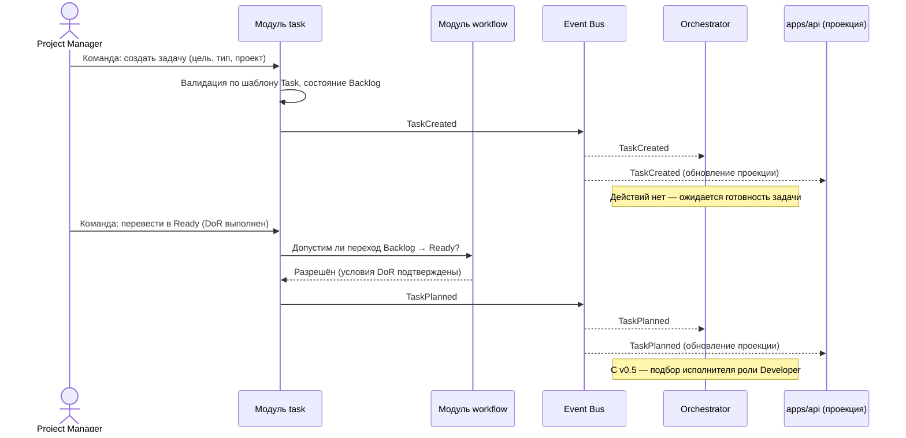

# Каталог событий

## Назначение

Определяет события AI Studio OS: источник, получателей, данные и последствия каждого. Дополняет принципы событийной модели ([event-model.md](event-model.md)) и state machine задачи ([state-machine.md](state-machine.md)). Схемы описаны концептуально; формат сериализации и версионирование — Decision Required ([ADR-002](../adr/ADR-002-event-delivery.md)).

## Содержание

### Общие поля всех событий

Каждое событие несёт метаданные: уникальный идентификатор события, тип, версию схемы, время возникновения, источник (модуль), инициатора (роль и исполнитель — человек/агент), идентификатор связанной сущности (обычно задачи) и проекта. Конкретный формат — [ADR-002](../adr/ADR-002-event-delivery.md).

Типовые получатели (подписки уточняются при реализации): **Orchestrator** (координация процесса), **проекция Dashboard** (отображение через API), **журнал событий** (всегда), **Memory** (с v0.7 — накопление опыта).

### Основные события

#### TaskCreated

- **Источник:** модуль `task` (по команде любой роли, обычно Project Manager).
- **Получатели:** журнал, проекция Dashboard, Orchestrator.
- **Данные:** идентификатор задачи, проект, эпик (если есть), название, тип, инициатор.
- **Последствия:** задача существует в состоянии Backlog; отображается в Dashboard; Orchestrator действий не предпринимает (ждёт TaskPlanned).

#### TaskPlanned

- **Источник:** модуль `task` (по команде Project Manager; переход Backlog → Ready).
- **Получатели:** журнал, проекция Dashboard, Orchestrator.
- **Данные:** идентификатор задачи, критерии приёмки (факт готовности DoR), приоритет.
- **Последствия:** задача доступна к взятию в работу; с v0.5 Orchestrator инициирует подбор исполнителя роли Developer.

#### TaskStarted

- **Источник:** модуль `task` (переход Ready → In Progress).
- **Получатели:** журнал, проекция Dashboard, Orchestrator.
- **Данные:** идентификатор задачи, исполнитель (человек или агент), время начала.
- **Последствия:** зафиксирован исполнитель; для агента модуль `execution` создаёт Execution; создаётся рабочая ветка (через Repository Provider).

#### TaskCompleted

- **Источник:** модуль `task` (финализация Testing → Done, после TestsPassed).
- **Получатели:** журнал, проекция Dashboard, Orchestrator, Memory (с v0.7).
- **Данные:** идентификатор задачи, итоговый отчёт (ссылка), фактические результаты.
- **Последствия:** Definition of Done подтверждён; задача в Done; опыт выполнения доступен для накопления в память.

#### ReviewRequested

- **Источник:** модуль `task` (переход In Progress → Review) — на основании готовности PR (данные от модуля `git`).
- **Получатели:** журнал, проекция Dashboard, Orchestrator.
- **Данные:** идентификатор задачи, ссылка на PR, автор изменений.
- **Последствия:** задача в Review; Orchestrator уведомляет/назначает исполнителя роли Reviewer (v0.5).

#### ReviewCompleted

- **Источник:** модуль `git` (итог ревью PR), транслируется в переход модулем `task`.
- **Получатели:** журнал, проекция Dashboard, Orchestrator, модуль `task`.
- **Данные:** идентификатор задачи, PR, вердикт (approved / changes requested), замечания (ссылка).
- **Последствия:** approved → задача переходит в Testing; changes requested → возврат в In Progress с замечаниями в истории задачи.

#### TestsPassed

- **Источник:** модуль `execution` (итог QA-проверки/тестового прогона).
- **Получатели:** журнал, проекция Dashboard, Orchestrator, модуль `task`.
- **Данные:** идентификатор задачи, объём проверок (уровни, сценарии), ссылка на отчёт/артефакты.
- **Последствия:** условия Testing выполнены; модуль `task` завершает задачу (TaskCompleted); момент слияния PR — по [ADR-008](../adr/ADR-008-git-policies.md).

#### TestsFailed

- **Источник:** модуль `execution` (итог QA-проверки/тестового прогона).
- **Получатели:** журнал, проекция Dashboard, Orchestrator, модуль `task`.
- **Данные:** идентификатор задачи, перечень провалов (сценарии, дефекты), ссылки на артефакты.
- **Последствия:** задача возвращается в In Progress; дефекты фиксируются в истории задачи (и/или отдельными задачами).

#### MergeRequested

- **Источник:** модуль `git` (запрошено слияние PR).
- **Получатели:** журнал, проекция Dashboard, Orchestrator.
- **Данные:** идентификатор задачи, PR, инициатор.
- **Последствия:** ожидание выполнения условий слияния (одобренное ревью; прочие условия — [ADR-008](../adr/ADR-008-git-policies.md)).

#### MergeCompleted

- **Источник:** модуль `git` (PR слит в основную ветку).
- **Получатели:** журнал, проекция Dashboard, Orchestrator, модуль `task`.
- **Данные:** идентификатор задачи, PR, коммит слияния.
- **Последствия:** изменения в основной ветке; ветка задачи закрывается; участие в условии Done (порядок относительно Testing — [ADR-008](../adr/ADR-008-git-policies.md)).

### Дополнительные события жизненного цикла

Требуются для полноты покрытия state machine (каждый переход публикует событие):

| Событие | Источник | Данные (ключевое) | Последствия |
| --- | --- | --- | --- |
| TaskReturnedToBacklog | модуль `task` | задача, причина | Ready → Backlog; DoR требуется заново |
| TaskBlocked | модуль `task` | задача, причина, требуемое решение | Переход в Blocked; Project Manager уведомлён |
| TaskUnblocked | модуль `task` | задача, снятое ограничение, целевое состояние | Возврат в Ready или In Progress |
| TaskCancelled | модуль `task` | задача, причина отмены | Переход в Cancelled; открытые PR закрываются |
| TaskArchived | модуль `task` | задача | Done/Cancelled → Archived; файл неизменяем |

Получатели дополнительных событий — стандартные (журнал, проекция Dashboard, Orchestrator).

### События доменных сущностей Domain Layer

Каталогизированы здесь при реализации Application Layer (TASK-042, EPIC-004) — определены в утверждённых спецификациях [Artifact](../specifications/domain/artifact.md), [Execution](../specifications/domain/execution.md), [Executor](../specifications/domain/executor.md), [Project](../specifications/domain/project.md) (раздел Domain Events каждой), но не были перенесены в этот каталог при утверждении спецификаций — пробел закрыт здесь и константами [internal/domain/event](../../internal/domain/event/README.md), а не заново решён.

| Событие | Источник | Данные (ключевое) |
| --- | --- | --- |
| ArtifactCreated | модуль `artifact` | Identifier, Type, Origin, Author, CreatedAt, Project |
| ArtifactPublished | модуль `artifact` | Identifier, момент, ссылка на породившее Execution (если есть) |
| ArtifactArchived | модуль `artifact` | Identifier, момент, состояние-источник (Draft \| Published) |
| ExecutionQueued | модуль `execution` | Identifier, Task, Executor, момент создания |
| ExecutionStarted | модуль `execution` | Identifier, момент |
| ExecutionSucceeded | модуль `execution` | Identifier, момент, ссылки на произведённые Artifact |
| ExecutionFailed | модуль `execution` | Identifier, момент, ссылки на произведённые к моменту сбоя Artifact |
| ExecutionAborted | модуль `execution` | Identifier, момент, состояние-источник (Queued \| Running) |
| ExecutorRegistered | модуль `executor` | Identifier, идентичность бэкенда, набор Role, момент |
| ExecutorActivated | модуль `executor` | Identifier, момент, состояние-источник (Registered \| Disabled) |
| ExecutorDisabled | модуль `executor` | Identifier, момент |
| ExecutorRetired | модуль `executor` | Identifier, момент, состояние-источник (Registered \| Active \| Disabled) |
| ProjectCreated | модуль `project` | Identifier, название, момент |
| RepositoryConnected | модуль `project` | Identifier проекта, ссылка на Repository, момент |
| ProjectActivated | модуль `project` | Identifier, момент |
| ProjectArchived | модуль `project` | Identifier, момент |

### Sequence Diagram: создание новой задачи

### Статус решений

- [ADR-002](../adr/ADR-002-event-delivery.md) — **принято**: In-Memory Event Bus; журнал в PostgreSQL; версия схемы — в каждом событии.
- [ADR-014](../adr/ADR-014-module-interaction.md) — **принято**: проекции строятся только из событий.
- [ADR-008](../adr/ADR-008-git-policies.md) — **принято**: слияние после Testing; порядок TestsPassed → MergeCompleted → TaskCompleted.

## Статус

Актуален

## Последнее обновление

2026-07-21
