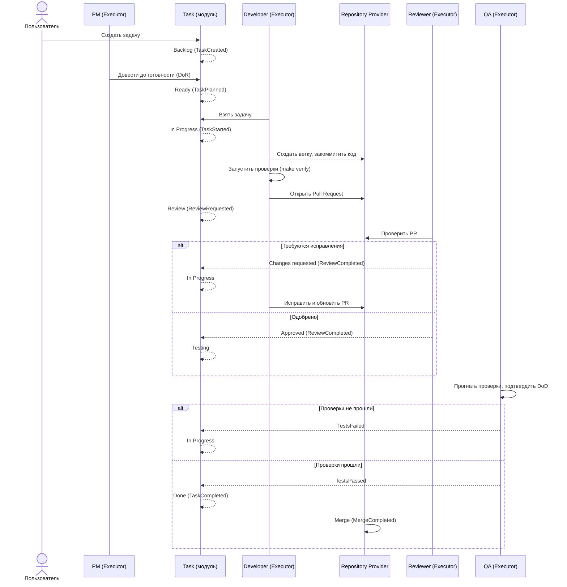

# Golden Path — эталонный сценарий

## Назначение

Единый сквозной сценарий, к которому должен приближать систему каждый новый модуль. Введён архитектором проекта 2026-07-20 как критерий приоритизации: если модуль не приближает платформу к этому сценарию — стоит спросить, зачем он нужен сейчас. Статус реализации на 2026-07-20: сценарий полностью аспирационный — реализованы только контракты ([EPIC-002](../roadmap/EPIC-002-foundation.md)), логика не начата (v0.3 Domain Layer — следующий шаг).

## Содержание

### Сценарий

Пользователь создаёт задачу → PM-исполнитель принимает её → задача попадает в план → Developer-исполнитель получает работу → создаёт ветку → пишет код → запускает проверки → открывает Pull Request → Reviewer-исполнитель проверяет → QA-исполнитель подтверждает → задача закрывается.

«Исполнитель» — Executor в терминах [ubiquitous-language.md](../domain/ubiquitous-language.md): человек или AI-агент, платформе не важно, кто именно.

### Sequence Diagram

Каждый переход состояния и каждое событие на диаграмме уже каталогизированы: состояния — [state-machine.md](state-machine.md), события — [events.md](events.md), контексты, которым принадлежит каждый шаг — [bounded-contexts.md](../domain/bounded-contexts.md). Golden Path не вводит новых сущностей — он показывает, как уже описанные части складываются в целое.

### Как использовать этот документ

1. **При планировании эпика** — спросить: какой шаг golden path становится возможным (или более надёжным/автоматизированным) после этого эпика?
2. **При проектировании модуля** — сверить контракт модуля с тем, что реально понадобится на соответствующем шаге сценария; не проектировать возможности, которых сценарий не требует (KISS).
3. **При приёмке эпика** — если ни один шаг сценария не стал ближе к реализации, задача — законный повод для Open Question «зачем это сейчас».

### Соответствие эпикам roadmap

| Шаг сценария | Эпик |
| --- | --- |
| Создание задачи, план | v0.3 Domain Layer, v0.4 Application Layer |
| Ветка, код, проверки | v0.5 Infrastructure Layer, v0.6 AI Agent Runtime |
| Pull Request, ревью | v0.5 Infrastructure Layer (Repository Provider), v0.6 |
| Подтверждение QA, релиз | v0.6 AI Agent Runtime и далее |

Полная схема версий — [ROADMAP.md](../../ROADMAP.md).

## Статус

Актуален

## Последнее обновление

2026-07-20
