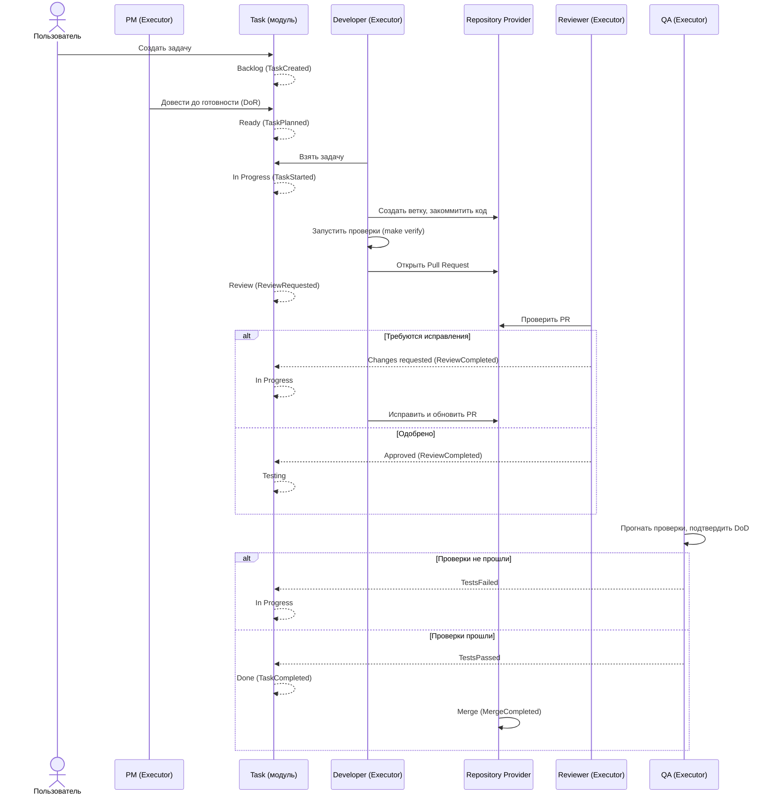

# Golden Path — эталонный сценарий

## Назначение

Единый сквозной сценарий, к которому должен приближать систему каждый новый модуль. Введён архитектором проекта 2026-07-20 как критерий приоритизации: если модуль не приближает платформу к этому сценарию — стоит спросить, зачем он нужен сейчас. При введении (2026-07-20) сценарий был полностью аспирационным: реализованы были только контракты ([EPIC-002](../roadmap/EPIC-002-foundation.md)), логика не начата. Текущий статус реализации — раздел «Что автоматизировано на сегодня» ниже.

## Содержание

### Сценарий

Пользователь создаёт задачу → PM-исполнитель принимает её → задача попадает в план → Developer-исполнитель получает работу → создаёт ветку → пишет код → запускает проверки → открывает Pull Request → Reviewer-исполнитель проверяет → QA-исполнитель подтверждает → задача закрывается.

«Исполнитель» — Executor в терминах [ubiquitous-language.md](../domain/ubiquitous-language.md): человек или AI-агент, платформе не важно, кто именно.

### Sequence Diagram

```mermaid
sequenceDiagram
    actor U as Пользователь
    participant PM as PM (Executor)
    participant SYS as Task (модуль)
    participant DEV as Developer (Executor)
    participant GIT as Repository Provider
    participant REV as Reviewer (Executor)
    participant QA as QA (Executor)

    U->>SYS: Создать задачу
    SYS-->>SYS: Backlog (TaskCreated)
    PM->>SYS: Довести до готовности (DoR)
    SYS-->>SYS: Ready (TaskPlanned)

    DEV->>SYS: Взять задачу
    SYS-->>SYS: In Progress (TaskStarted)
    DEV->>GIT: Создать ветку, закоммитить код
    DEV->>DEV: Запустить проверки (make verify)
    DEV->>GIT: Открыть Pull Request
    SYS-->>SYS: Review (ReviewRequested)

    REV->>GIT: Проверить PR
    alt Требуются исправления
        REV-->>SYS: Changes requested (ReviewCompleted)
        SYS-->>SYS: In Progress
        DEV->>GIT: Исправить и обновить PR
    else Одобрено
        REV-->>SYS: Approved (ReviewCompleted)
        SYS-->>SYS: Testing
    end

    QA->>QA: Прогнать проверки, подтвердить DoD
    alt Проверки не прошли
        QA-->>SYS: TestsFailed
        SYS-->>SYS: In Progress
    else Проверки прошли
        QA-->>SYS: TestsPassed
        SYS-->>SYS: Done (TaskCompleted)
        GIT->>GIT: Merge (MergeCompleted)
    end
```

Каждый переход состояния и каждое событие на диаграмме уже каталогизированы: состояния — [state-machine.md](state-machine.md), события — [events.md](events.md), контексты, которым принадлежит каждый шаг — [bounded-contexts.md](../domain/bounded-contexts.md). Golden Path не вводит новых сущностей — он показывает, как уже описанные части складываются в целое.

### Как использовать этот документ

1. **При планировании эпика** — спросить: какой шаг golden path становится возможным (или более надёжным/автоматизированным) после этого эпика?
2. **При проектировании модуля** — сверить контракт модуля с тем, что реально понадобится на соответствующем шаге сценария; не проектировать возможности, которых сценарий не требует (KISS).
3. **При приёмке эпика** — если ни один шаг сценария не стал ближе к реализации, задача — законный повод для Open Question «зачем это сейчас».

### Соответствие эпикам roadmap

| Шаг сценария | Эпик |
| --- | --- |
| Создание задачи, план | v0.3 Domain Layer, v0.4 Application Layer |
| Ветка, код, проверки | v0.5 Infrastructure Layer, v0.6 AI Agent Runtime |
| Pull Request, ревью | v0.5 Infrastructure Layer (Repository Provider), v0.6 |
| Подтверждение QA, релиз | v0.6 AI Agent Runtime и далее |

Полная схема версий — [ROADMAP.md](../../ROADMAP.md).

### Что автоматизировано на сегодня (2026-07-25)

Сценарий больше не полностью аспирационный, как при его введении. Участок **«Developer-исполнитель получает работу → создаёт ветку → пишет код → открывает Pull Request → задача переходит в Review»** выполняется платформой самостоятельно: `apps/orchestrator` ([EPIC-010](../roadmap/EPIC-010-orchestrator.md), v1.0) реагирует на `TaskPlanned`, назначает исполнителя, создаёт ветку, запускает агента в песочнице и доводит исполнение до Pull Request'а и запроса ревью — [orchestrator.md](orchestrator.md).

С [EPIC-011](../roadmap/EPIC-011-executor-roles.md) автоматизирован и **вердикт ревью**: на `ReviewRequested` Orchestrator запускает агента роли Reviewer (один и тот же адаптер, роль различает промпт — [ADR-007](../adr/ADR-007-pm-qa-executors.md)), тот изучает изменения ветки относительно основной и записывает решение, а платформа применяет его через `CompleteReview` — задача уходит в Testing или обратно в In Progress. Агент-ревьюер допущен [ADR-008](../adr/ADR-008-git-policies.md).

**За человеком остаются ровно две точки — и это решение, а не незаконченность** (нормативное описание — [workflow.md](workflow.md#контрольные-точки-человека))**:** приведение задачи к Definition of Ready (роль PM) и финальное приёмочное решение (роль QA). ADR-007 называет контрольными точками человека именно их, а вердикт QA к тому же немедленно сливает Pull Request в основную ветку (ADR-008). Поэтому их автоматизация идёт **после** механизма подтверждения человеком, а не до него: иначе платформа доводила бы изменения до слияния сама, а документация утверждала бы, что человек подтверждает.

Автоматический вердикт ревью при этом не открывает путь к бесконтрольному слиянию: он лишь переводит задачу в Testing, а слияние происходит на шаге QA, который остаётся человеческим.

## Статус

Актуален

## Последнее обновление

2026-07-25
