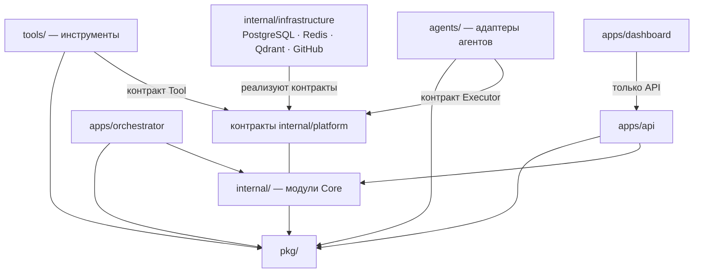

# Границы модулей

## Назначение

Определяет границы всех модулей и каталогов кода AI Studio OS: что каждому разрешено использовать, что запрещено и какие зависимости допустимы. Обязателен к соблюдению при любой реализации; нарушение границ — блокирующее замечание ревью.

## Содержание

### Диаграмма допустимых зависимостей

Стрелка означает «может зависеть от». Всё, что не разрешено явно, — запрещено.

### Правила междоменного взаимодействия (принято, [ADR-014](../adr/ADR-014-module-interaction.md))

Схема: **Core → Events → Workflow → Executor Runtime → Tools**; все проходят через Core. (Дословная формулировка принятого [ADR-014](../adr/ADR-014-module-interaction.md) использует термин «Agent Runtime» — терминология обновлена здесь после [ADR-005](../adr/ADR-005-executor-contract.md), суть решения не менялась.)

1. Модуль Core может импортировать **только публичный контракт** другого модуля (`internal/core` и схемы событий). Импорт внутренних пакетов чужого модуля запрещён.
2. Изменение чужого состояния — только командой модулю-владельцу.
3. Узнавание о чужих изменениях и чтение чужих данных — только через события и собственные проекции; синхронные read-контракты не вводятся.
4. Жёсткие запреты: **Tool → Core** (инструмент не вызывает ядро), **Executor → Database** (исполнитель не обращается к хранилищам платформы), **Workflow → SQL** (workflow без прямого доступа к БД; персистентность — через порты Core).

### Границы по модулям и каталогам

#### Физическая структура `internal/` (слои, [ADR-015](../adr/ADR-015-internal-layering.md))

| Каталог | Слой | Содержание |
| --- | --- | --- |
| `internal/domain/shared/` | Domain | Язык домена: Role, TaskState (позже ID, ошибки, value objects) |
| `internal/domain/<module>/` | Domain | Доменные модули; концептуальный набор — 10 модулей ([core.md](core.md)); созданы: task, project, event, workflow |
| `internal/application/` | Application | Сценарии использования и проекции (заполняется эпиком Application Layer) |
| `internal/platform/` | Platform | Абстракции платформы: EventBus, Executor, Tool, MemoryProvider, RepositoryProvider; домен-агностичен |
| `internal/infrastructure/` | Infrastructure | Адаптеры контрактов platform и портов domain: PostgreSQL, In-Memory Event Bus, GitHub, память |

Правила зависимостей слоёв: `domain/shared` — только stdlib; `domain/<module>` — stdlib + shared + публичные контракты соседних модулей; `application` — domain + platform; `platform` — только stdlib; `infrastructure` — platform (реализация) + порты domain. Обратные зависимости запрещены. Каждый модуль обязан иметь README (назначение, зависимости, события, ответственность) — [documentation.md](../development/documentation.md).

#### Доменные модули (`internal/domain/<module>`)

- **Разрешено:** стандартная библиотека; `pkg/`; `internal/domain/shared`; публичные контракты других доменных модулей (события, интерфейсы).
- **Запрещено:** `internal/platform` (домен не знает о платформенных абстракциях); инфраструктурные библиотеки и драйверы; внутренние пакеты других модулей; `internal/application`, `internal/infrastructure`, `apps/`, `agents/`, `tools/`; фреймворки.
- **Допустимые зависимости:** направлены только «наружу-внутрь»: модуль ничего не знает о том, кто его вызывает.

#### `apps/api`

- **Разрешено:** публичные контракты модулей Core (команды, чтение); `pkg/`; HTTP-инфраструктура слоя доставки (после [ADR-003](../adr/ADR-003-api-protocol.md) и [ADR-009](../adr/ADR-009-toolchain.md)).
- **Запрещено:** доменная логика (правила — только в Core); прямой доступ к хранилищам в обход модулей; импорт внутренних пакетов модулей; зависимость от `apps/orchestrator`, `agents/`, `tools/`.

#### `apps/dashboard`

- **Разрешено:** только API платформы (`apps/api`); собственный UI-код.
- **Запрещено:** прямой доступ к БД, шине событий, модулям Core, GitHub; дублирование доменных правил в UI.

#### `apps/orchestrator`

- **Разрешено:** подписка на события (Event Bus); публичные команды модулей Core; контракт Executor; `pkg/`.
- **Запрещено:** доменные правила (решения о допустимости переходов — у модулей `task`/`workflow`); хранение доменного состояния; прямой доступ к хранилищам; знание о конкретных AI-провайдерах (только контракт Executor).

#### `pkg/`

- **Разрешено:** стандартная библиотека; сторонние библиотеки, утверждённые ADR.
- **Запрещено:** `internal/`, `apps/`, `agents/`, `tools/`; любое доменное знание.

#### `agents/` (адаптеры агентов)

- **Разрешено:** контракт Executor (публичный контракт Core); `pkg/`; SDK/CLI своего провайдера (по [ADR-005](../adr/ADR-005-executor-contract.md)).
- **Запрещено:** импорт модулей Core (кроме опубликованного контракта); прямой доступ к хранилищам платформы; обход Tool Layer для действий во внешней среде (после v0.8); знание о других адаптерах.

#### `tools/` (реализации инструментов)

- **Разрешено:** контракт Tool; `pkg/`; библиотеки для действия во внешней среде (git, файловая система, запуск процессов) — по утверждённому стеку; контракт Repository Provider для git-операций.
- **Запрещено:** доменная логика; импорт модулей Core (кроме опубликованных контрактов); вызов других инструментов напрямую; хранение состояния между вызовами.

#### Адаптеры инфраструктуры (`internal/infrastructure/`)

- **Разрешено:** реализация портов Core и доменных модулей; драйверы своей системы (PostgreSQL, Redis, Qdrant, GitHub API); `pkg/`.
- **Запрещено:** доменные решения; реализация портов чужой подсистемы «заодно»; зависимость адаптеров друг от друга.

#### `memory/`, `projects/`, `tasks/` (данные, не код)

- Файловые хранилища данных платформы; правила их структуры — [memory.md](memory.md), [ADR-013](../adr/ADR-013-managed-projects.md), [ADR-004](../adr/ADR-004-task-storage.md). Код в этих каталогах запрещён.

### Сводная матрица

| Кто ↓ зависит от → | Core (контракты) | Core (внутренности) | pkg | apps/api | orchestrator | agents/ | tools/ | Инфраструктура |
| --- | --- | --- | --- | --- | --- | --- | --- | --- |
| Модуль Core | ✅ | ❌ | ✅ | ❌ | ❌ | ❌ | ❌ | ❌ (только порты) |
| apps/api | ✅ | ❌ | ✅ | — | ❌ | ❌ | ❌ | ✅ слой доставки |
| apps/dashboard | ❌ | ❌ | ❌ | ✅ | ❌ | ❌ | ❌ | ❌ |
| apps/orchestrator | ✅ | ❌ | ✅ | ❌ | — | ✅ контракт | ❌ | ❌ |
| pkg/ | ❌ | ❌ | — | ❌ | ❌ | ❌ | ❌ | ❌ |
| agents/ | ✅ контракт | ❌ | ✅ | ❌ | ❌ | — | ✅ через Tool Layer | ✅ свой провайдер |
| tools/ | ✅ контракт | ❌ | ✅ | ❌ | ❌ | ❌ | — | ✅ своя среда |

### Статус решений

- [ADR-014](../adr/ADR-014-module-interaction.md) — **принято** (см. правила выше).
- [ADR-009](../adr/ADR-009-toolchain.md) — **принято**: единый `go.mod` в корне; границы обеспечиваются `internal/`, этим документом и линтером. Физическое размещение адаптеров инфраструктуры — на этапе Infrastructure.

## Статус

Актуален

## Последнее обновление

2026-07-20
