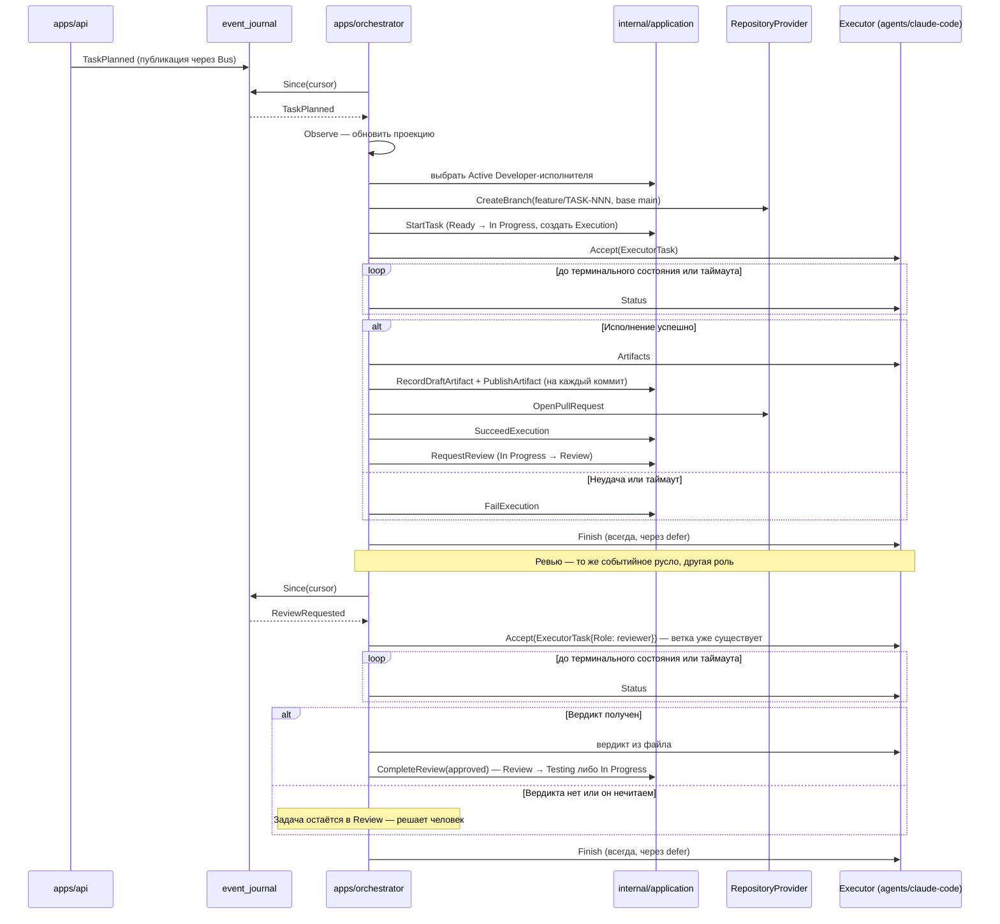

# Orchestrator — координация процесса

## Назначение

Описывает механизм `apps/orchestrator` ([EPIC-010](../roadmap/EPIC-010-orchestrator.md), v1.0): как платформа сама, без участия человека, доводит запланированную задачу до Pull Request'а и ревью. Документ описывает **фактическую реализацию**, а не замысел; границы модуля — [module-boundaries.md](module-boundaries.md), устройство модуля — [apps/orchestrator/README.md](../../apps/orchestrator/README.md).

## Содержание

### Роль в системе

Orchestrator — единственный компонент, который **принимает решение начать работу**. Он реагирует на события жизненного цикла задачи и назначает исполнителя через контракт Executor ([ADR-005](../adr/ADR-005-executor-contract.md)). Доменных правил в нём нет: допустимость каждого перехода решают модули `task`/`workflow`, вызываемые исключительно через `internal/application` ([ADR-014](../adr/ADR-014-module-interaction.md)). Собственного durable-состояния он тоже не хранит.

До EPIC-010 этот шаг золотого пути ([golden-path.md](golden-path.md)) выполнял человек вручную через `apps/api`. Orchestrator закрывает именно его — участок от `TaskPlanned` (Ready) до `ReviewRequested` (Review).

### Почему опрос журнала, а не подписка на шину

Продуктивная шина событий ([ADR-002](../adr/ADR-002-event-delivery.md), `internal/infrastructure/eventbus.Bus`) — синхронная и **внутрипроцессная**: `Subscribe` регистрирует обработчик в памяти конкретного процесса. `apps/api` и `apps/orchestrator` — разные процессы с разными `wiring.System`, поэтому подписаться на шину, в которую публикует API, физически невозможно.

Orchestrator вместо этого **опрашивает журнал событий** (`event_journal`) по курсору через порт `application.EventJournal`. Это не отмена ADR-002, а прямое продолжение уже записанного в ней плана («интерфейс стабилен; позже — Redis Streams/NATS»): опрос журнала — объяснимый промежуточный шаг между «только in-process» и настоящей шиной сообщений, не требующий новой зависимости.

**Курсор — по монотонной последовательности вставки (`seq`), а не по времени.** `OccurredAt` штампуется доменом **до** записи строки, поэтому при параллельных запросах строка может стать видимой со штампом более ранним, чем уже прочитанная: курсор по времени перешагнул бы её навсегда, не сообщив ни об одной ошибке. `seq` (`BIGSERIAL`, миграция 0007) выдаётся в момент `INSERT`, поэтому порядок курсора и есть порядок записи. Подробно — [BUGFIX-005-адъяцентная задача TASK-080](../../tasks/done/TASK-080-event-journal-since.md).

### Наполнение read-модели

Читать состояние задачи Orchestrator обязан через проекцию — это единственный путь чтения Task (ADR-014), напрямую к `TaskStore` он не обращается ([module-boundaries.md](module-boundaries.md): прямой доступ к хранилищам запрещён). Но проекция строится из событий, а на шину этот процесс не подписан, поэтому она наполняется из того же журнала:

- `Poller.Seed` применяет **историю** журнала при старте — без побочных эффектов;
- `Dispatcher.Observe` применяет **каждое новое** событие, до диспетчеризации.

Без истории у задачи, созданной до запуска процесса и запланированной после, не было бы ни заголовка, ни scope — агент получил бы пустой промпт. Именно на этом пути обнаружился [BUGFIX-004](../../tasks/done/BUGFIX-004-projection-rebuild-loses-envelope-data.md): пересборка проекции из журнала теряла все данные `Envelope.WithData`.

### Sequence Diagram: от TaskPlanned до Review

Слияние в основную ветку на этой диаграмме не появляется: оно происходит на шаге QA, который остаётся за человеком до эпика подтверждения.

### Роли: один адаптер, разные инструкции

Один и тот же адаптер и **один** Docker-образ исполняют все роли; различие — только в блоке инструкций промпта, построенном из `ExecutorTask.Role` ([ADR-007](../adr/ADR-007-pm-qa-executors.md) фиксирует именно это, не отдельные адаптеры или образы).

| Роль | Что делает | Диспетчеризуется |
| --- | --- | --- |
| Developer | Пишет код в клонированной ветке, коммитит | На `TaskPlanned` |
| Reviewer | Изучает `origin/main...HEAD`, ничего не меняет, выносит вердикт | На `ReviewRequested` |
| PM, QA | — | Нет: их выходы — контрольные точки человека (ADR-007) |

Неизвестная и недиспетчеризуемая роль — **ошибка до запуска песочницы**, а не нейтральные инструкции: молчаливое использование Developer-блока сказало бы агенту «закоммить код», когда его просили планировать или проверять.

**Вердикт — не артефакт.** Коммиты платформа видит сама (`git log`), а «одобрено»/«нужны правки» из кода возврата вывести нельзя, не смешав отказ агента с отрицательным вердиктом. Поэтому агент записывает решение в файл, а платформа его применяет — данные от агента, решение за платформой (тот же приём, что базовый коммит для `Artifacts`). Контракт Executor при этом не расширяется: ADR-005 фиксирует четыре возможности, вердикт ни одна из них — он приходит через отдельный интерфейс рядом с контрактом.

**Вердикт по умолчанию не выдумывается.** Отказ агента, таймаут, отсутствующий или нераспознанный вердикт — задача остаётся в Review, решение переходит к человеку. Выдуманное одобрение продвинуло бы код к слиянию без реальной проверки; выдуманный отказ отправил бы разработчика переделывать без причины.

### Порядок шагов и его обоснование

Порядок здесь не произволен — каждый из двух неочевидных шагов выбран по конкретной причине:

1. **Ветка создаётся до `StartTask`.** Самый вероятный отказ на этом участке — неверный репозиторий, недействительный токен, недоступность GitHub. Если задачу перевести раньше, такой отказ оставит её In Progress с живым Execution и без ветки, в которую можно коммитить, а повторных попыток нет. Обратный порядок оставляет задачу в Ready, откуда её можно запустить вручную. Обнаружено живым прогоном (TASK-082), закреплено тестом.
2. **Артефакты записываются до `SucceedExecution`.** Прикрепить артефакт можно только к Execution в состоянии Running (доменный инвариант спецификации Execution) — после `Succeed` он уже не Running.

### Поведение при отказе

Полная матрица — [apps/orchestrator/README.md](../../apps/orchestrator/README.md). Общие принципы:

- **Ошибка обработчика не останавливает цикл**, и курсор всё равно сдвигается: иначе одно необрабатываемое событие заблокировало бы все последующие навсегда. Задача остаётся в текущем состоянии и может быть проведена человеком через `apps/api`.
- **Ошибка чтения журнала курсор не двигает** — следующий тик повторит то же окно: транзиентная недоступность БД не должна ни ронять процесс, ни пропускать события.
- **`Finish` вызывается всегда** — эфемерная рабочая копия умирает вместе с контейнером ([ADR-006](../adr/ADR-006-agent-execution-environment.md)).
- **Провал агента — это исход, а не ошибка платформы:** Execution переходит в Failed, задача остаётся In Progress. `ExecutionFailed` не переводит Task нигде в платформе ([state-machine.md](state-machine.md)) — вернуть её в работу решает человек.
- **Повторные попытки (retry) сознательно не реализованы** в v1.0.

### Ограничения этой версии

Все — осознанные и проверяемые, а не забытые:

| Ограничение | Причина | Что потребуется для снятия |
| --- | --- | --- |
| Курсор хранится в памяти процесса | Простота v1.0; отказ операционно виден (оператор знает, что перезапустил процесс) | Одно целое число в таблице — с курсором по `seq` это тривиально |
| Один Developer-исполнитель, идентификатор фиксирован | Доверенная однопользовательская установка (тот же принцип, что [ADR-012](../adr/ADR-012-identity-and-auth.md)) | Правило выбора среди нескольких исполнителей одной роли |
| Слежение синхронное — цикл не обрабатывает другие события во время исполнения | Доменная модель не отслеживает занятость исполнителя (`AvailableForAssignment` — это только «Active ли он»), поэтому два `TaskPlanned` подряд назначили бы работу одному бэкенду параллельно | Признак занятости в спецификации Executor — **доменное** решение, не горутины в Orchestrator |
| Диспетчеризуются роли Developer и Reviewer; PM и QA — нет | Их выходы — контрольные точки человека по [ADR-007](../adr/ADR-007-pm-qa-executors.md) (приём DoR, финальное Done), а вердикт QA немедленно сливает Pull Request | Механизм подтверждения человеком (эпик декомпозиции v1.0), и только после него — диспетчеризация PM/QA |
| Работа ревьюера не отражается в журнале как Execution | `WorkService.StartTask` — единственный путь создать Execution, но он делает переход Ready → In Progress, которого при ревью не происходит | Use-case «создать Execution без перехода» — расширение Application Layer |
| Один репозиторий на проект (первый подключённый) | `Project.repositories` — неупорядоченное множество без «основного» | Правило выбора в домене |

### Связь с остальной архитектурой

- Событие, на которое реагирует Orchestrator, и события, которые он порождает, — [events.md](events.md).
- Участок золотого пути, который он автоматизирует, — [golden-path.md](golden-path.md).
- Разрешённые и запрещённые зависимости, включая узкое исключение для composition root, — [module-boundaries.md](module-boundaries.md).
- Контракт исполнителя и среда его запуска — [interfaces.md](interfaces.md), [ADR-005](../adr/ADR-005-executor-contract.md), [ADR-006](../adr/ADR-006-agent-execution-environment.md).

## Статус

Актуален

## Последнее обновление

2026-07-25
