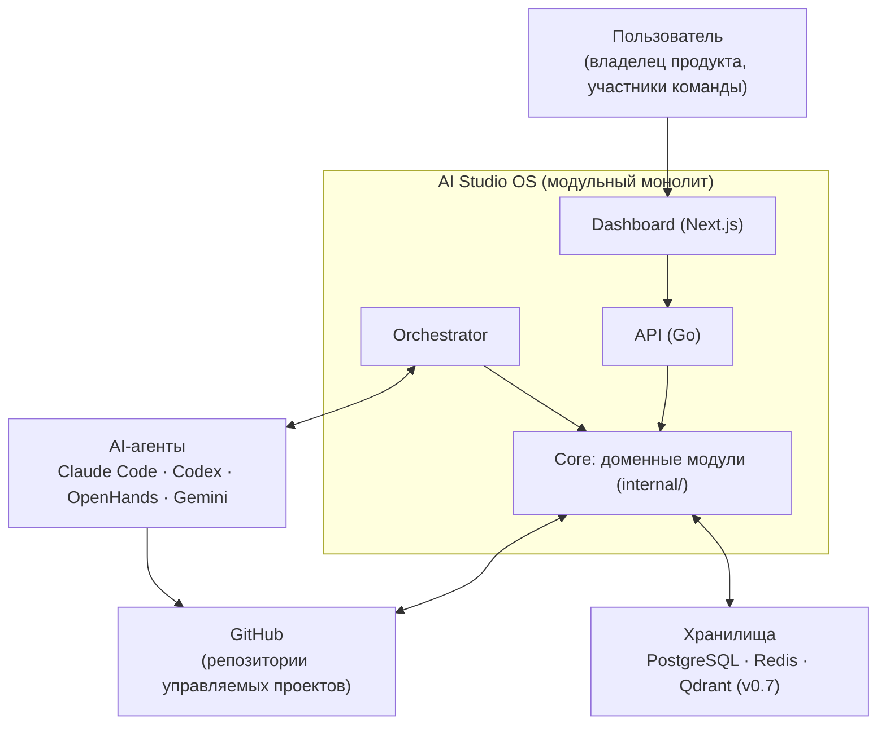

# Обзор архитектуры

## Назначение

Высокоуровневое описание архитектуры AI Studio OS: что представляет собой система, из каких крупных частей состоит и какими принципами руководствуется. Точка входа в архитектурную документацию.

## Содержание

### Что такое AI Studio OS

AI Studio OS — платформа управления разработкой ПО, в которой роли команды (Project Manager, Developer, QA Engineer) исполняются людьми или AI-агентами. Платформа задаёт единый процесс: постановка задачи → реализация → контроль качества, — и обеспечивает наблюдаемость этого процесса для человека.

Архитектура обслуживает видение продукта, а не наоборот — см. [VISION.md](../../VISION.md) (горизонты 1/2/5 лет) и эталонный сценарий [golden-path.md](golden-path.md). Единый язык предметной области и границы контекстов — [docs/domain/](../domain/README.md).

### Context Diagram

### Ключевые архитектурные решения

1. **Modular Monolith.** Один деплоймент с жёсткими границами модулей ([module-boundaries.md](module-boundaries.md)). Переход к сервисам возможен позже и потребует ADR.
2. **Event-Driven Architecture.** Модули взаимодействуют через события ([event-model.md](event-model.md), каталог — [events.md](events.md)). Механизм доставки — Decision Required ([ADR-002](../adr/ADR-002-event-delivery.md)).
3. **Agent-agnostic ядро.** Ядро не знает о конкретных AI-моделях; агенты подключаются через адаптеры ([agents.md](agents.md)); Claude Code — реализация роли Developer по умолчанию.
4. **Clean Architecture.** Зависимости направлены внутрь; состав ядра — [core.md](core.md).
5. **Documentation First / Interface First.** Контракты ([interfaces.md](interfaces.md)) и документы создаются раньше реализации.

### Карта архитектурной документации

| Документ | Содержание |
| --- | --- |
| [system-design.md](system-design.md) | Системный дизайн: приложения, хранилища, потоки |
| [components.md](components.md) | Компоненты и их ответственность (+ Component Diagram) |
| [core.md](core.md) | Состав ядра, управление состоянием, зависимости |
| [domain-model.md](domain-model.md) | Сущности домена и владение данными (+ Domain Diagram) |
| [module-boundaries.md](module-boundaries.md) | Границы модулей: разрешено / запрещено |
| [interfaces.md](interfaces.md) | Контракты: Agent, Tool, Event Bus, Workflow, Memory, Repository |
| [state-machine.md](state-machine.md) | Канонический жизненный цикл задачи (+ State Diagram) |
| [event-model.md](event-model.md) | Принципы событийной модели |
| [events.md](events.md) | Каталог событий (+ Sequence Diagram) |
| [workflow.md](workflow.md) | Организация процесса: роли и правила |
| [data-flow.md](data-flow.md) | Движение информации (+ Data Flow Diagram) |
| [golden-path.md](golden-path.md) | Эталонный сквозной сценарий (+ Sequence Diagram) |
| [engineering-principles.md](engineering-principles.md) | Инженерные принципы в практике |
| [project-structure.md](project-structure.md) | Структура репозитория |
| [memory.md](memory.md) | Память агентов (концепция, v0.7) |
| [agents.md](agents.md) | Модель агентов |
| [tools.md](tools.md) | Слой инструментов (концепция, v0.8) |

### Architecture Freeze

**Архитектура заморожена 2026-07-19.** Пять блокирующих ADR приняты решением архитектора проекта:

| ADR | Решение |
| --- | --- |
| [ADR-002](../adr/ADR-002-event-delivery.md) | In-Memory Event Bus; интерфейс неизменен; будущая замена — Redis Streams / NATS |
| [ADR-003](../adr/ADR-003-api-protocol.md) | REST API (Dashboard → REST → Go Core) |
| [ADR-004](../adr/ADR-004-task-storage.md) | PostgreSQL — источник истины задач; `tasks/` — markdown-экспорт |
| [ADR-009](../adr/ADR-009-toolchain.md) | Go 1.24 · Next.js 15 · pnpm · golangci-lint · gofumpt |
| [ADR-014](../adr/ADR-014-module-interaction.md) | Все проходят через Core: Core → Events → Workflow → Agent Runtime → Tools |

Замороженная архитектура **не изменяется**; любое изменение — только новым ADR, заменяющим существующий. Реализация ведётся строго по этим документам.

### Остающиеся Decision Required

Не блокируют текущую реализацию, решаются перед соответствующими этапами: [ADR-001](../adr/ADR-001-license.md) (лицензия), [ADR-005](../adr/ADR-005-agent-adapter-contract.md) и [ADR-006](../adr/ADR-006-agent-execution-environment.md) (v0.3), [ADR-007](../adr/ADR-007-pm-qa-executors.md), [ADR-008](../adr/ADR-008-git-policies.md), [ADR-010](../adr/ADR-010-documentation-language.md), [ADR-011](../adr/ADR-011-task-identifiers.md), [ADR-012](../adr/ADR-012-identity-and-auth.md), [ADR-013](../adr/ADR-013-managed-projects.md).

## Статус

Актуален

## Последнее обновление

2026-07-20
