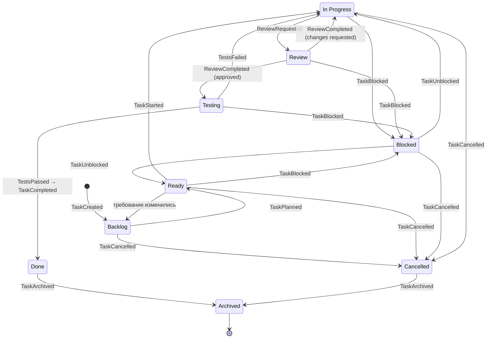

# State Machine задачи

## Назначение

Канонический жизненный цикл задачи AI Studio OS: полный перечень состояний и правил переходов. Единственный источник истины для всех документов, workflow-определений и будущей реализации. Роли и организация процесса — в [workflow.md](workflow.md); события переходов — в [events.md](events.md).

## Содержание

### State Diagram

### Состояния

| Состояние | Смысл | Терминальное |
| --- | --- | --- |
| Backlog | Задача зафиксирована, но не готова к работе | нет |
| Ready | Definition of Ready выполнен; задачу можно брать в работу | нет |
| In Progress | Исполнитель роли Developer выполняет задачу | нет |
| Review | Изменения оформлены (PR), идёт ревью кода | нет |
| Testing | Ревью одобрено; QA проверяет поведение и качество | нет |
| Done | Definition of Done выполнен | нет (→ Archived) |
| Blocked | Работа невозможна до внешнего решения; причина зафиксирована | нет |
| Cancelled | Задача отменена решением Project Manager; причина зафиксирована | нет (→ Archived) |
| Archived | Задача в архиве; файл неизменяем | да |

### Правила переходов

| Переход | Инициатор | Условие (guard) | Событие |
| --- | --- | --- | --- |
| → Backlog (создание) | Любая роль | Задача оформлена по шаблону Task | TaskCreated |
| Backlog → Ready | Project Manager | Definition of Ready выполнен | TaskPlanned |
| Ready → Backlog | Project Manager | Требования изменились, DoR нарушен | TaskReturnedToBacklog |
| Ready → In Progress | Developer | Задача свободна; исполнитель определён | TaskStarted |
| In Progress → Review | Developer | PR создан; чек-лист PR пройден; отчёт в задаче | ReviewRequested |
| Review → In Progress | Reviewer | Вердикт «changes requested»; замечания зафиксированы | ReviewCompleted |
| Review → Testing | Reviewer | Вердикт «approved» | ReviewCompleted |
| Testing → In Progress | QA Engineer | Тесты/проверки не пройдены; дефекты зафиксированы | TestsFailed |
| Testing → Done | QA Engineer | Проверки пройдены; Definition of Done выполнен | TestsPassed, затем TaskCompleted |
| Ready / In Progress / Review / Testing → Blocked | Любая роль | Причина и требуемое решение записаны в задаче | TaskBlocked |
| Blocked → Ready | Project Manager | Блокировка снята; работа не начиналась либо требуется переназначение | TaskUnblocked |
| Blocked → In Progress | Project Manager | Блокировка снята; исполнитель продолжает | TaskUnblocked |
| Backlog / Ready / Blocked / In Progress → Cancelled | Project Manager | Причина отмены записана; незавершённые PR закрываются | TaskCancelled |
| Done → Archived | Project Manager | Обычно при закрытии версии | TaskArchived |
| Cancelled → Archived | Project Manager | Причина отмены зафиксирована | TaskArchived |

### Инварианты

1. Разрешены только переходы из таблицы; любой иной переход — ошибка.
2. Каждый переход публикует ровно одно событие жизненного цикла (Testing → Done — два: TestsPassed и TaskCompleted).
3. Blocked и Cancelled требуют записанной причины — переход без неё запрещён.
4. Из Blocked задача возвращается только в Ready или In Progress (не в Review/Testing: после блокировки результат должен быть переподтверждён процессом).
5. Из Review и Testing отмена невозможна — сначала возврат в In Progress (чтобы корректно закрыть PR и зафиксировать состояние).
6. Done и Cancelled — предтерминальные: единственный дальнейший переход — Archived.
7. Archived — терминальное состояние; файл задачи неизменяем.
8. Проверку допустимости перехода выполняет модуль `workflow` ([interfaces.md](interfaces.md)); состояние изменяет модуль `task`.

### Хранение состояния и файловая система `tasks/`

**Принято ([ADR-004](../adr/ADR-004-task-storage.md)):** источник истины состояния задачи — PostgreSQL; переходы выполняет Task Engine (модуль `task`) с валидацией по этому документу; `tasks/` — генерируемый markdown-экспорт, отражающий все 9 состояний.

**Переходный период** (до ввода Task Engine в строй) — файловый процесс остаётся рабочим носителем:

- Testing: файл задачи остаётся в `review/`; факт перехода Review → Testing фиксируется записью в разделе «История» задачи.
- Cancelled: файл перемещается в `archive/` с записью причины отмены в «Истории».

### Статус решений

- [ADR-004](../adr/ADR-004-task-storage.md) — **принято** (см. выше).
- [ADR-008](../adr/ADR-008-git-policies.md) — **принято** (2026-07-21): слияние PR — после Testing (QA проверяет ветку, в `main` попадает только проверенное; актуальность ветки относительно базы обязательна перед merge). Guard перехода Testing → Done включает факт слияния PR; порядок событий: TestsPassed → MergeCompleted → TaskCompleted.

## Статус

Актуален

## Последнее обновление

2026-07-21
