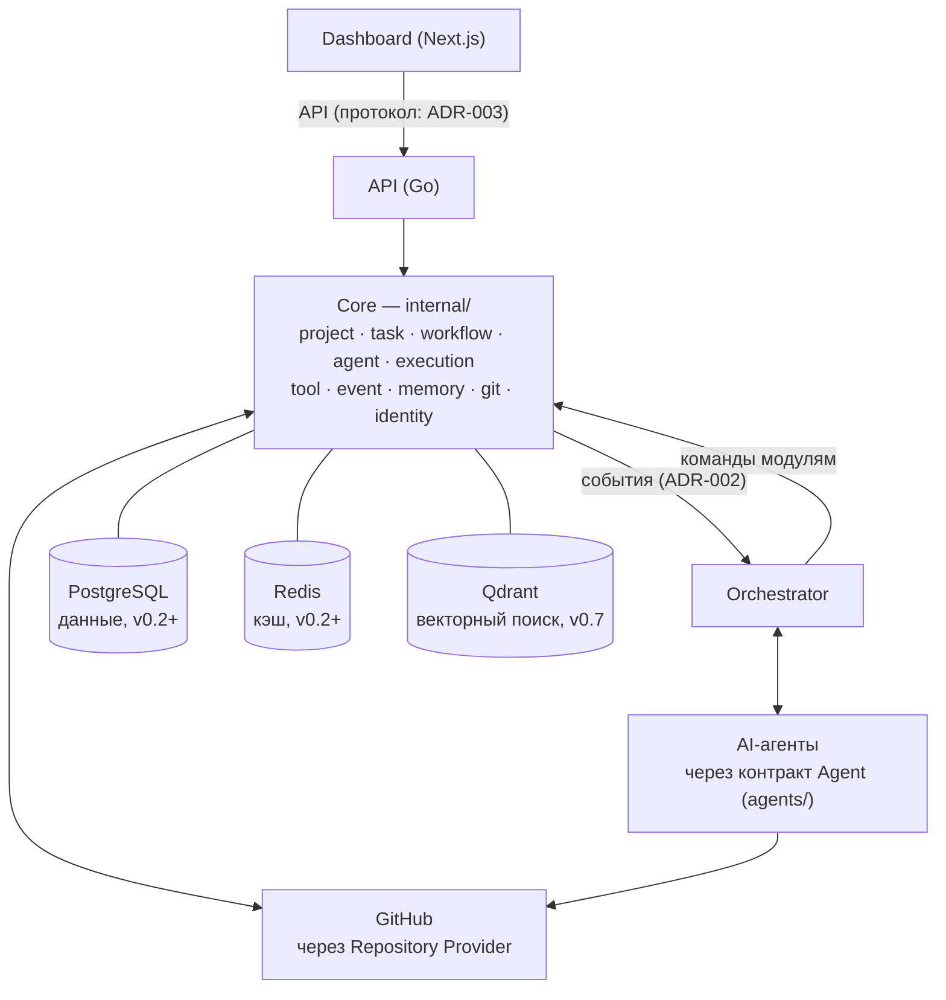

# Системный дизайн

## Назначение

Описывает состав системы на уровне приложений и хранилищ, направления зависимостей и основные потоки данных. Детализирует [overview.md](overview.md); ответственность отдельных компонентов — в [components.md](components.md); движение информации — в [data-flow.md](data-flow.md).

## Содержание

### Состав системы

Система развёртывается как **модульный монолит** и состоит из трёх приложений, ядра и набора хранилищ.

### Приложения

- **API (`apps/api/`)** — единая точка входа для клиентов платформы; предоставляет данные о проектах, задачах и агентах. Протокол — REST ([ADR-003](../adr/ADR-003-api-protocol.md)).
- **Dashboard (`apps/dashboard/`)** — веб-интерфейс на Next.js; взаимодействует с системой только через API.
- **Orchestrator (`apps/orchestrator/`)** — управляет процессом: назначает исполнителей ролей, инициирует работу агентов, реагирует на события переходов задач. Доменных правил не содержит ([core.md](core.md)).

Все три приложения используют доменную логику из `internal/`; дублирование доменной логики в приложениях запрещено ([module-boundaries.md](module-boundaries.md)).

### Хранилища

| Хранилище | Роль | Этап подключения |
| --- | --- | --- |
| PostgreSQL | Основные данные; **источник истины задач** ([ADR-004](../adr/ADR-004-task-storage.md)) | v0.2+ |
| Redis | Кэш и быстрые операционные данные (не доставка событий) | v0.2+ |
| Qdrant | Векторный поиск для памяти агентов | v0.7 |

События доставляются In-Memory Event Bus внутри процесса ([ADR-002](../adr/ADR-002-event-delivery.md)); журнал событий сохраняется в PostgreSQL. Модели данных проектируются на этапе Domain Layer.

### Направления зависимостей

По Clean Architecture ([core.md](core.md), [module-boundaries.md](module-boundaries.md)):

1. `internal/` (домен) не зависит ни от приложений, ни от инфраструктуры.
2. Приложения (`apps/*`) зависят от домена через публичные контракты.
3. Инфраструктура (БД, GitHub, AI-провайдеры) подключается через адаптеры, реализующие порты домена.
4. `pkg/` не содержит доменной логики и не зависит от `internal/`.

### Основной поток данных

Полное описание — [data-flow.md](data-flow.md); канонический жизненный цикл задачи — [state-machine.md](state-machine.md). Кратко:

1. Project Manager готовит задачу (Backlog → Ready) → события TaskCreated, TaskPlanned.
2. Developer (по умолчанию Claude Code) выполняет задачу в отдельной ветке → TaskStarted, ReviewRequested.
3. Reviewer проверяет PR → ReviewCompleted; QA проверяет поведение → TestsPassed/TestsFailed.
4. Задача завершается (TaskCompleted), изменения — в `main` (MergeCompleted).
5. Dashboard отображает состояние процесса через API из проекций.

### Принятые решения

- [ADR-002](../adr/ADR-002-event-delivery.md) — In-Memory Event Bus (интерфейс неизменен; будущая замена: Redis Streams / NATS).
- [ADR-003](../adr/ADR-003-api-protocol.md) — REST API (Dashboard → REST → Go Core).
- [ADR-004](../adr/ADR-004-task-storage.md) — PostgreSQL — источник истины задач; `tasks/` — markdown-экспорт.
- [ADR-014](../adr/ADR-014-module-interaction.md) — все проходят через Core; междоменное взаимодействие — только события.

## Статус

Актуален

## Последнее обновление

2026-07-19
