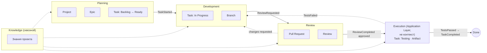

# Bounded Contexts — границы контекстов

## Назначение

Определяет границы контекстов предметной области AI Studio OS (DDD, [Bounded Context](https://martinfowler.com/bliki/BoundedContext.html)) — кто отвечает за какую часть «золотого пути» ([golden-path.md](../architecture/golden-path.md)) и как контексты связаны. Введено архитектором проекта 2026-07-20, перед моделированием Domain Layer (v0.3, EPIC-003).

## Содержание

### Контексты и владение

**Execution — не Bounded Context** (решение архитектора, 2026-07-20). Исполнение — сквозная техническая возможность системы, координируемая Application Layer, а не отдельная предметная область: все контексты нуждаются в исполнении (Development исполняет код, Review может исполнять проверки), поэтому выделять его в отдельный контекст означало бы владение тем, чем на самом деле пользуются все. Модули `execution`, `executor`, `tool` (и Artifact, который они производят) существуют как доменные модули, но не принадлежат одному контексту — вызываются Application Layer по мере необходимости любым из контекстов.

Оставшиеся четыре контекста соответствуют фазам жизненного цикла задачи, которыми управляет человек или Executor в конкретной роли ([state-machine.md](../architecture/state-machine.md)):

| Контекст | Ответственность | Основная роль | Состояния Task |
| --- | --- | --- | --- |
| **Planning** | Постановка цели, декомпозиция на Task, доведение до готовности | Project Manager | Backlog, Ready |
| **Development** | Реализация: код, ветка, коммиты, PR | Developer | In Progress |
| **Review** | Проверка предложенного изменения | Reviewer | Review |
| **Knowledge** | Накопление и предоставление знаний — обслуживает остальные контексты, не привязан к одной фазе | — (сквозной) | — |

Состояние Task `Testing` (QA-проверка) намеренно не отнесено ни к одному из четырёх контекстов — см. пояснение ниже и раздел «Открытые вопросы».

**Важное уточнение владения данными:** контекст — это про то, **кто действует** на данной фазе, а не про то, кто технически хранит данные. Единственный технический владелец состояния Task на всём его жизненном цикле — модуль `task` ([ADR-004](../adr/ADR-004-task-storage.md)); контексты сменяют друг друга как процессные фазы одной и той же задачи, не «крадут» её данные. Это согласуется с [ADR-014](../adr/ADR-014-module-interaction.md): модуль-владелец не меняется, взаимодействие между контекстами — только через события.

### Отображение на доменные модули

| Контекст | Доменные модули (текущие/планируемые) |
| --- | --- |
| Planning | `project`, `task` (создание, переходы Backlog↔Ready), `workflow` (авторинг определений) |
| Development | `task` (переход в In Progress), `git` (Branch) |
| Review | `git` (PullRequest, Review) |
| Knowledge | `memory` |

**Сквозные (не принадлежат одному контексту):** `execution`, `executor`, `tool` — техническая возможность исполнения, координируемая Application Layer, используется всеми контекстами по мере необходимости (не Bounded Context, см. выше). `artifact` — тоже сквозной по производству (любой контекст, вызывающий Execution, может стать источником нового Artifact), но данные принадлежат Project напрямую, не одному контексту-фазе ([ADR-016](../adr/ADR-016-artifact-aggregate-root.md), Aggregate Root).

**Shared Kernel** (общее ядро, не принадлежит одному контексту): `event` (словарь и шина событий), `workflow` (контракт `Rules` — правила переходов, к которым обращаются все контексты), `identity` (пользователи/сессии, когда войдут в реализацию). Это соответствует [ADR-015](../adr/ADR-015-internal-layering.md): `internal/platform` и общий язык домена (`internal/domain/shared`) уже физически выделены как не принадлежащие одному модулю.

### Карта контекстов

Переходы между контекстами — те же события, что уже каталогизированы в [events.md](../architecture/events.md); эта карта не вводит новых событий, а группирует существующие по контекстам. `Execution` намеренно нарисован вне подграфов контекстов (не `subgraph`) — он не контекст, а сквозная возможность Application Layer, которой пользуется Review (и потенциально другие контексты) для перехода `Task: Testing` → Done.

### Открытые вопросы

Граница Execution закрыта решением архитектора 2026-07-20: Execution — не Bounded Context, а сквозная возможность Application Layer (см. выше); состояние Task `Testing` не привязано ни к одному из четырёх контекстов на карте — это согласованное, а не временное упрощение.

Остаётся:

- Итоговое разбиение `internal/domain/<module>` по контекстам (например, стоит ли физически группировать пакеты по контексту, а не только концептуально) — не решалось; это архитектурный вопрос уровня ADR, не берётся с ходу.
- Где именно в коде живёт координация Execution как «Application Layer concern» (`internal/application`) и как она соотносится с доменными модулями `execution`/`executor`/`tool` — вопрос проектирования EPIC-003, не Bounded Context.

## Статус

Актуален

## Последнее обновление

2026-07-20
