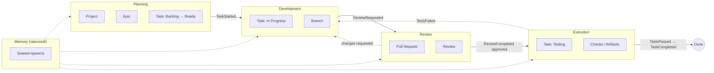

# Bounded Contexts — границы контекстов

## Назначение

Определяет границы контекстов предметной области AI Studio OS (DDD, [Bounded Context](https://martinfowler.com/bliki/BoundedContext.html)) — кто отвечает за какую часть «золотого пути» ([golden-path.md](../architecture/golden-path.md)) и как контексты связаны. Введено архитектором проекта 2026-07-20, перед моделированием Domain Layer (v0.3, EPIC-003).

## Содержание

### Контексты и владение

Пять контекстов соответствуют фазам жизненного цикла задачи ([state-machine.md](../architecture/state-machine.md)):

| Контекст | Ответственность | Основная роль | Состояния Task |
| --- | --- | --- | --- |
| **Planning** | Постановка цели, декомпозиция на Task, доведение до готовности | Project Manager | Backlog, Ready |
| **Development** | Реализация: код, ветка, коммиты, PR | Developer | In Progress |
| **Review** | Проверка предложенного изменения | Reviewer | Review |
| **Execution** | Прогон проверок и подтверждение качества | QA Engineer | Testing |
| **Memory** | Накопление и предоставление знаний — обслуживает остальные контексты, не привязан к одной фазе | — (сквозной) | — |

**Важное уточнение владения данными:** контекст — это про то, **кто действует** на данной фазе, а не про то, кто технически хранит данные. Единственный технический владелец состояния Task на всём его жизненном цикле — модуль `task` ([ADR-004](../adr/ADR-004-task-storage.md)); контексты сменяют друг друга как процессные фазы одной и той же задачи, не «крадут» её данные. Это согласуется с [ADR-014](../adr/ADR-014-module-interaction.md): модуль-владелец не меняется, взаимодействие между контекстами — только через события.

### Отображение на доменные модули

| Контекст | Доменные модули (текущие/планируемые) |
| --- | --- |
| Planning | `project`, `task` (создание, переходы Backlog↔Ready), `workflow` (авторинг определений) |
| Development | `task` (переход в In Progress), `git` (Branch) |
| Review | `git` (PullRequest, Review) |
| Execution | `execution`, `tool` |
| Memory | `memory` |

**Shared Kernel** (общее ядро, не принадлежит одному контексту): `event` (словарь и шина событий), `workflow` (контракт `Rules` — правила переходов, к которым обращаются все контексты), `identity` (пользователи/сессии, когда войдут в реализацию). Это соответствует [ADR-015](../adr/ADR-015-internal-layering.md): `internal/platform` и общий язык домена (`internal/domain/shared`) уже физически выделены как не принадлежащие одному модулю.

### Карта контекстов

Переходы между контекстами — те же события, что уже каталогизированы в [events.md](../architecture/events.md); эта карта не вводит новых событий, а группирует существующие по контекстам.

### Открытые вопросы

- **Граница контекста Execution.** Принята интерпретация «Execution = фаза QA/тестирования (состояние Testing)», по аналогии с остальными контекстами как фазами жизненного цикла Task. Альтернативная трактовка: Execution — сквозной контекст исполнения (как Memory), объединяющий *все* запуски Executor'ов (Development и Review тоже требуют исполнения агентом). Решение принято по аналогии с остальными контекстами-фазами, но исходная формулировка допускала оба прочтения — требует подтверждения архитектора при проектировании модуля `execution` (EPIC-003 или позже).
- Итоговое разбиение `internal/domain/<module>` по контекстам (например, стоит ли физически группировать пакеты по контексту, а не только концептуально) — не решалось; это архитектурный вопрос уровня ADR, не берётся с ходу.

## Статус

Актуален

## Последнее обновление

2026-07-20
